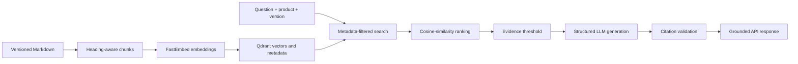

<div align="center">

# 📚 Version-Aware Documentation Assistant

### Ask technical questions. Get grounded answers from the correct product version.

A controlled retrieval-augmented generation service designed to prevent technical answers from mixing incompatible documentation versions.


</div>

---

## The Problem

Technical documentation changes between product releases. A conventional documentation chatbot may retrieve information from multiple versions and confidently provide outdated or conflicting guidance.

| Question | Version 1 | Version 2 |
|---|---:|---:|
| What is the API rate limit? | 100 requests/minute | 250 requests/minute |
| How do I authenticate? | API key | OAuth 2.0 |
| Which export formats are supported? | CSV | CSV and JSON |

This project prevents cross-version mixing by filtering the searchable knowledge base before semantic ranking and answer generation.

## Project Objective

Build a documentation assistant that:

- Parses versioned technical documentation into meaningful chunks
- Stores semantic embeddings and metadata in Qdrant
- Restricts retrieval to the selected product and version
- Generates grounded answers from retrieved evidence
- Returns validated source citations
- Abstains when sufficient evidence is unavailable
- Supports bounded agent behavior for clarification and version comparison
- Measures retrieval, version-isolation, citation, and answer quality

## Architecture



Metadata filtering and semantic search serve different purposes:

- **Metadata filtering** determines which product and version the system is allowed to search.
- **Semantic similarity** ranks the eligible chunks by relevance to the question.
- **Evidence validation** controls which retrieved passages may reach the LLM.
- **Citation validation** prevents unsupported or invented sources from being returned.

## Example Behavior

**Request**

```json
{
  "question": "How do I authenticate?",
  "product": "examplecloud",
  "version": "v2"
}
```

**Response**

```json
{
  "answered": true,
  "answer": "Version 2 uses OAuth 2.0 bearer tokens.",
  "citations": [
    {
      "evidence_id": "E1",
      "product": "examplecloud",
      "version": "v2",
      "source": "examplecloud/v2/api-guide.md",
      "title": "ExampleCloud API Guide",
      "section": "Authentication"
    }
  ]
}
```

Submitting the same question with `v1` returns API-key authentication from the v1 documentation. Wrong-version chunks are excluded before the LLM receives evidence.

## Safety and Reliability Controls

- Product and version filters are enforced inside the Qdrant query
- Only results meeting the similarity threshold become evidence
- Retrieved passages receive trusted evidence IDs such as `E1`
- The LLM must return a structured answer with supplied evidence IDs
- Citations are reconstructed from trusted application metadata
- Missing or invented citation IDs cause the system to abstain
- Insufficient retrieval evidence produces an explicit no-answer response
- Documentation is treated as untrusted reference text to reduce prompt-injection risk
- Automated tests replace external dependencies and never make paid OpenAI calls

## Current Status

### Completed

- [x] Initialize the Python and FastAPI project
- [x] Add `/health` and `/questions` endpoints
- [x] Create synthetic v1 and v2 documentation
- [x] Parse Markdown using heading-aware boundaries
- [x] Create immutable `DocumentChunk` objects
- [x] Attach product, version, source, title, and section metadata
- [x] Generate deterministic chunk and Qdrant point identifiers
- [x] Generate embeddings with FastEmbed
- [x] Store vectors and payload metadata in Qdrant
- [x] Retrieve chunks using cosine similarity
- [x] Enforce product and version filters during retrieval
- [x] Select evidence using a similarity threshold
- [x] Generate structured, grounded answers with OpenAI
- [x] Validate evidence IDs and reconstruct trusted citations
- [x] Abstain when evidence or citations are insufficient
- [x] Initialize and cache the application RAG service
- [x] Verify end-to-end v1 and v2 version isolation
- [x] Maintain 31 passing automated tests

### Planned

- [ ] Create a larger evaluation dataset
- [ ] Tune the similarity threshold using evaluation results
- [ ] Add bounded agent behavior
- [ ] Support version clarification and comparison
- [ ] Add a simple user interface
- [ ] Connect to Qdrant Cloud
- [ ] Deploy the application
- [ ] Record a project demonstration

## Project Structure

```text
version-aware-doc-assistant/
├── app/
│   ├── __init__.py
│   ├── api_models.py
│   ├── dependencies.py
│   ├── generation.py
│   ├── ingestion.py
│   ├── main.py
│   ├── models.py
│   ├── openai_generator.py
│   ├── rag_service.py
│   └── vector_store.py
├── data/
│   └── examplecloud/
│       ├── v1/
│       │   └── api-guide.md
│       └── v2/
│           └── api-guide.md
├── tests/
│   ├── __init__.py
│   ├── test_health.py
│   ├── test_ingestion.py
│   ├── test_openai_generator.py
│   ├── test_questions.py
│   ├── test_rag_service.py
│   └── test_retrieval.py
├── .gitignore
├── README.md
└── requirements.txt
```

## Technology

| Area | Technology | Purpose |
|---|---|---|
| Language | Python 3.12 | Application and RAG logic |
| API | FastAPI and Pydantic | Validated API contracts |
| Document processing | Custom Markdown parser | Heading-aware chunks |
| Embeddings | FastEmbed | Local semantic vectors |
| Vector database | Qdrant | Storage, filtering, and similarity search |
| Similarity measure | Cosine similarity | Semantic ranking |
| Generation | OpenAI Responses API | Structured, grounded answers |
| Testing | Pytest | Unit and integration-style tests |
| Deployment | Render and Qdrant Cloud | Planned hosted architecture |

## Run Locally

### 1. Create a virtual environment

```cmd
python -m venv .venv
```

### 2. Activate it in Command Prompt

```cmd
.venv\Scripts\activate.bat
```

### 3. Install dependencies

```cmd
pip install -r requirements.txt
```

The embedding model may be downloaded during the first retrieval operation.

### 4. Configure OpenAI

```cmd
set OPENAI_API_KEY=your-api-key
set OPENAI_MODEL=gpt-5.6-luna
```

Never commit API keys or include them in project documentation.

### 5. Run the tests

```cmd
pytest -q
```

### 6. Start the API

```cmd
uvicorn app.main:app --reload
```

Open:

- Health check: http://127.0.0.1:8000/health
- Interactive API documentation: http://127.0.0.1:8000/docs

## Key Design Decisions

### Heading-aware chunking

Sections are split at level-two Markdown headings instead of arbitrary character boundaries. This preserves topic meaning and keeps related facts together.

### Metadata on every chunk

Each chunk stores its product, version, source, title, and section. Because chunks are retrieved independently, each one must remain independently filterable and traceable.

### Filtering before semantic ranking

Product and version restrictions are enforced inside the Qdrant query. Wrong-version content is excluded before it can reach answer generation.

### Deterministic orchestration

Retrieval, score filtering, evidence numbering, citation validation, and abstention remain application-controlled. The LLM words the answer but does not decide which versions it may access.

### Trusted citations

The model cites evidence IDs rather than generating source information. The application maps valid IDs back to trusted metadata, preventing invented filenames or sections from becoming citations.

### Lazy initialization

The document index and RAG service are created on the first question and cached for later requests. Health checks and automated endpoint tests do not require an OpenAI key or make paid API calls.

### Local Qdrant during development

The application currently uses Qdrant's in-memory mode. This keeps local development simple while preserving the same vector-store abstraction that can later connect to Qdrant Cloud.

### Evidence threshold

The current `0.25` similarity threshold is provisional. Manual testing found the relevant Authentication result at `0.2747`, while unrelated results scored `0.1086` and `-0.0456`. A larger evaluation dataset will be used to calibrate the final threshold.

### Controlled RAG before agents

The deterministic RAG pipeline is implemented and tested before agent behavior is added. This creates a measurable baseline and ensures future agent tools operate within clear retrieval and security boundaries.

## Testing Strategy

The test suite verifies:

- All expected Markdown sections are processed
- Version-specific facts remain distinct
- Chunk and point identifiers are deterministic
- Source metadata is preserved
- All chunks are indexed
- Semantic questions retrieve the expected sections
- Product and version filters prevent cross-version results
- Invalid retrieval inputs are rejected
- Results below the evidence threshold are excluded
- The pipeline abstains when evidence is insufficient
- Ranked results receive stable evidence IDs
- Missing, duplicate, and invented citations are handled safely
- Untrusted document content remains inside evidence boundaries
- API inputs are validated and normalized
- Endpoint responses correctly map answers and citations
- Automated tests do not call OpenAI

## Evaluation Goals

The completed system will measure:

- Version-isolation accuracy
- Retrieval recall at `k`
- Top-result accuracy
- Citation correctness
- Answer correctness
- Proper abstention rate
- Agent tool-selection accuracy
- Response latency
- Approximate model cost

## Why This Project Matters

This project goes beyond a basic “chat with documents” demonstration. It demonstrates controlled RAG through metadata-aware retrieval, conflicting-version isolation, evidence thresholds, structured generation, trusted citations, explicit abstention, and testable safety boundaries.

The same architecture can later support:

- Product editions
- Programming-language versions
- Customer or tenant isolation
- Department-level permissions
- Role-based access control
- Time-sensitive policies
- Confidentiality classifications

## Current Limitations

- The dataset is intentionally small and synthetic
- Only Markdown documents are currently supported
- Qdrant runs in memory and is recreated when the server restarts
- The similarity threshold requires broader evaluation
- Agent behavior, cloud persistence, deployment, and a user interface remain planned

These limitations are being addressed incrementally so each architectural layer can be tested and evaluated independently.