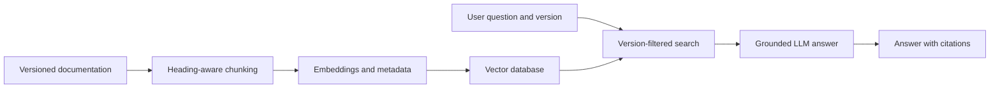

<div align="center">

# 📚 Version-Aware Documentation Assistant

### Ask technical questions. Get answers from the correct product version.

A retrieval-augmented documentation assistant designed to prevent answers from mixing information across software versions.


</div>

---

## The problem

Technical documentation changes between product releases. A normal documentation chatbot may retrieve information from the wrong version and confidently provide an outdated answer.

For example:

| Question | Version 1 | Version 2 |
|---|---:|---:|
| What is the API rate limit? | 100 requests/minute | 250 requests/minute |
| How do I authenticate? | API key | OAuth 2.0 |
| Which export formats are supported? | CSV | CSV and JSON |

This project ensures that a question about **version 1 is answered exclusively from version 1 documentation**.

## Project objective

Build a technical-documentation assistant that:

- Retrieves passages from a user-selected product version
- Prevents information from different versions from being mixed
- Generates answers grounded in retrieved documentation
- Includes source and section citations
- Abstains when the selected documentation does not contain an answer
- Measures retrieval quality, answer accuracy and version isolation

## Planned workflow



## Example behavior

**Question**

> What is the API request limit?

**Selected version: v1**

> Version 1 permits 100 API requests per minute.  
> Source: `v1/api-guide.md` — Request limits

**Selected version: v2**

> Version 2 permits 250 API requests per minute.  
> Source: `v2/api-guide.md` — Request limits

## Current status

- [x] Initialize the Python project
- [x] Add the FastAPI application
- [x] Add a `/health` endpoint
- [x] Create synthetic v1 and v2 documentation
- [x] Add an automated health test
- [ ] Parse Markdown by heading
- [ ] Attach version metadata to chunks
- [ ] Generate embeddings
- [ ] Add version-filtered vector retrieval
- [ ] Generate citation-backed answers
- [ ] Add evaluation and version-isolation tests
- [ ] Add a simple user interface

## Project structure

```text
version-aware-doc-assistant/
├── app/
│   ├── __init__.py
│   └── main.py
├── data/
│   └── examplecloud/
│       ├── v1/
│       │   └── api-guide.md
│       └── v2/
│           └── api-guide.md
├── tests/
│   ├── __init__.py
│   └── test_health.py
├── .gitignore
├── README.md
└── requirements.txt
```

## Run locally

### 1. Create and activate a virtual environment

```powershell
python -m venv .venv
.\.venv\Scripts\Activate.ps1
```

### 2. Install dependencies

```powershell
pip install -r requirements.txt
```

### 3. Start the API

```powershell
uvicorn app.main:app --reload
```

### 4. Open the application

- Health check: http://127.0.0.1:8000/health
- Interactive API documentation: http://127.0.0.1:8000/docs

## Run tests

```powershell
pytest
```

## Planned technology

| Area | Technology |
|---|---|
| Language | Python |
| API | FastAPI |
| Testing | Pytest |
| Document format | Markdown initially; PDF later |
| Vector storage | To be selected |
| LLM and embeddings | Provider-independent design |
| Evaluation | Custom tests, followed by Ragas |

## Evaluation goals

The finished system will measure:

- Version-isolation accuracy
- Retrieval recall at `k`
- Citation correctness
- Answer correctness
- Proper abstention rate
- Response latency
- Approximate model cost

## Why this project matters

This project goes beyond a basic “chat with documents” demonstration. Its central challenge is **metadata-aware retrieval**: ensuring the model receives only documentation belonging to the selected version.

The same design can later support:

- Product editions
- Customer or tenant isolation
- Department-level permissions
- Role-based access control
- Time-sensitive policies
- Multiple programming-language versions

## License

This project is intended for educational and portfolio use.