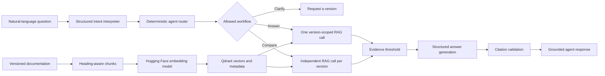

<div align="center">

# 📚 Version-Aware Documentation Assistant

### Ask technical questions. Get grounded answers from the correct product version.

A controlled, agentic retrieval-augmented generation service designed to prevent technical answers from mixing incompatible documentation versions.


</div>

---

## The Problem

Technical documentation changes between product releases. A conventional documentation chatbot may retrieve information from multiple versions and confidently provide outdated or conflicting guidance.

| Question | Version 1 | Version 2 |
|---|---:|---:|
| What is the API rate limit? | 100 requests/minute | 250 requests/minute |
| How do I authenticate? | API key | OAuth 2.0 |
| Which export formats are supported? | CSV | CSV and JSON |

This project prevents cross-version mixing by filtering the searchable knowledge base before semantic ranking and answer generation.

## Project Objective

Build an enterprise-style documentation assistant that:

- Parses versioned technical documentation into meaningful chunks
- Stores semantic embeddings and metadata in Qdrant
- Restricts retrieval to the selected product and version
- Generates grounded answers from retrieved evidence
- Returns validated source citations
- Abstains when sufficient evidence is unavailable
- Uses bounded agent behavior for clarification and version comparison
- Rewrites natural-language requests into focused retrieval questions
- Measures retrieval, isolation, citation, routing, and answer quality

## Architecture



Each layer has a separate responsibility:

- **Intent interpretation** extracts explicitly mentioned versions, comparison intent, and a focused technical question.
- **Deterministic routing** validates the product, versions, and permitted workflow.
- **Metadata filtering** determines which documentation the system is allowed to search.
- **Semantic similarity** ranks eligible chunks by relevance.
- **Evidence validation** controls which passages may reach answer generation.
- **Citation validation** prevents unsupported or invented sources from being returned.

## Agent Behaviors

The bounded agent supports three workflows.

### Single-version answer

```text
“How do I authenticate in v2?”
→ interpret v2
→ validate v2
→ search only v2
→ return a grounded v2 answer
```

### Version clarification

```text
“How do I authenticate?”
→ no explicit version
→ ask the user to select v1 or v2
→ do not retrieve or generate an answer
```

### Version comparison

```text
“Compare authentication between v1 and v2.”
→ extract v1, v2, and comparison intent
→ rewrite as “How does authentication work?”
→ execute independent v1 and v2 RAG workflows
→ preserve separate answers and citations
```

Comparison does not combine both versions in one vector search. Each answer remains independently filtered, grounded, and traceable.

## Example Agent Request

**Request**

```json
{
  "question": "Compare authentication between v1 and v2.",
  "product": "examplecloud"
}
```

**Response shape**

```json
{
  "action": "compare_versions",
  "message": null,
  "version_answers": [
    {
      "version": "v1",
      "answered": true,
      "answer": "Version 1 uses an API key in the X-API-Key header.",
      "citations": [
        {
          "evidence_id": "E1",
          "product": "examplecloud",
          "version": "v1",
          "source": "examplecloud/v1/api-guide.md",
          "title": "ExampleCloud API Guide",
          "section": "Authentication"
        }
      ]
    },
    {
      "version": "v2",
      "answered": true,
      "answer": "Version 2 uses an OAuth 2.0 bearer token.",
      "citations": [
        {
          "evidence_id": "E1",
          "product": "examplecloud",
          "version": "v2",
          "source": "examplecloud/v2/api-guide.md",
          "title": "ExampleCloud API Guide",
          "section": "Authentication"
        }
      ]
    }
  ]
}
```

## Safety and Reliability Controls

- Product and version filters are enforced inside Qdrant queries
- The intent interpreter cannot retrieve documents or generate answers
- Model-generated routing intent is treated as an untrusted proposal
- The deterministic router rejects unknown products and invented versions
- Comparisons require at least two explicitly requested versions
- Ambiguous multi-version requests produce clarification
- Every version is retrieved and grounded independently
- Only results meeting the similarity threshold become evidence
- The LLM may cite only supplied evidence IDs
- Citations are reconstructed from trusted application metadata
- Missing or invented citation IDs cause the system to abstain
- Insufficient evidence produces an explicit no-answer response
- Documentation remains inside untrusted evidence boundaries
- Automated tests replace external dependencies and do not make paid OpenAI calls

## Current Status

### Completed

- [x] Initialize the Python and FastAPI project
- [x] Add `/health`, `/questions`, and `/agent/questions` endpoints
- [x] Create synthetic v1 and v2 documentation
- [x] Parse Markdown using heading-aware boundaries
- [x] Create immutable document chunks with source metadata
- [x] Generate deterministic chunk and Qdrant point identifiers
- [x] Generate local embeddings using a Hugging Face-hosted model
- [x] Store vectors and payload metadata in Qdrant
- [x] Retrieve chunks using cosine similarity
- [x] Enforce product and version filters during retrieval
- [x] Select evidence using a similarity threshold
- [x] Generate structured, grounded answers with OpenAI
- [x] Validate evidence IDs and reconstruct trusted citations
- [x] Abstain when evidence or citations are insufficient
- [x] Define bounded answer, clarification, and comparison actions
- [x] Add deterministic agent workflow routing
- [x] Add natural-language intent interpretation
- [x] Add focused-query rewriting for retrieval
- [x] Execute comparisons through isolated version-specific RAG calls
- [x] Reject invented products and versions before retrieval
- [x] Verify agent workflows through automated and live API tests
- [x] Maintain 69 passing automated tests

### Next

- [ ] Add multiple synthetic products and additional versions
- [ ] Create a labeled retrieval and agent evaluation dataset
- [ ] Compare Hugging Face embedding models
- [ ] Tune the similarity threshold using evaluation results
- [ ] Measure retrieval Recall@k and top-result accuracy
- [ ] Measure version-isolation and citation correctness
- [ ] Measure answer correctness and abstention behavior
- [ ] Measure agent routing and focused-query accuracy
- [ ] Measure latency and approximate API cost
- [ ] Evaluate a Hugging Face reranker against the baseline
- [ ] Add a simple user interface
- [ ] Connect to Qdrant Cloud
- [ ] Add CI and deploy the application
- [ ] Record a project demonstration

## Project Structure

```text
version-aware-doc-assistant/
├── app/
│   ├── __init__.py
│   ├── agent_models.py
│   ├── agent_router.py
│   ├── agent_service.py
│   ├── api_models.py
│   ├── dependencies.py
│   ├── generation.py
│   ├── ingestion.py
│   ├── intent_interpreter.py
│   ├── main.py
│   ├── models.py
│   ├── openai_generator.py
│   ├── rag_service.py
│   └── vector_store.py
├── data/
│   └── examplecloud/
│       ├── v1/
│       │   └── api-guide.md
│       └── v2/
│           └── api-guide.md
├── tests/
│   ├── __init__.py
│   ├── test_agent_models.py
│   ├── test_agent_questions.py
│   ├── test_agent_router.py
│   ├── test_agent_service.py
│   ├── test_health.py
│   ├── test_ingestion.py
│   ├── test_intent_interpreter.py
│   ├── test_natural_language_agent.py
│   ├── test_openai_generator.py
│   ├── test_questions.py
│   ├── test_rag_service.py
│   └── test_retrieval.py
├── .gitignore
├── README.md
└── requirements.txt
```

## Technology

| Area | Technology | Purpose |
|---|---|---|
| Language | Python 3.12 | Application and agent orchestration |
| API | FastAPI and Pydantic | Validated API contracts |
| Document processing | Custom Markdown parser | Heading-aware chunks |
| Embeddings | FastEmbed with a Hugging Face model | Local semantic vectors |
| Vector database | Qdrant | Storage, filtering, and similarity search |
| Similarity measure | Cosine similarity | Initial semantic ranking |
| Generation | OpenAI Responses API | Structured intent and grounded answers |
| Agent design | Bounded custom orchestration | Clarify, answer, and compare workflows |
| Testing | Pytest | Unit and integration-style tests |
| Deployment | Render and Qdrant Cloud | Planned hosted architecture |

## Run Locally

### 1. Create and activate the environment

```cmd
python -m venv .venv
.venv\Scripts\activate.bat
```

### 2. Install dependencies

```cmd
pip install -r requirements.txt
```

The embedding model may be downloaded during the first retrieval operation.

### 3. Configure OpenAI

```cmd
set OPENAI_API_KEY=your-api-key
set OPENAI_MODEL=gpt-5.6-luna
```

Never commit API keys or include them in project documentation.

### 4. Run tests

```cmd
pytest -q
```

### 5. Start the API

```cmd
uvicorn app.main:app --reload
```

Open:

- Health check: http://127.0.0.1:8000/health
- Interactive API documentation: http://127.0.0.1:8000/docs

## Key Design Decisions

### Heading-aware chunking

Sections are split at meaningful Markdown headings instead of arbitrary character boundaries. This preserves topic meaning and keeps related facts together.

### Filtering before semantic ranking

Product and version restrictions are enforced inside Qdrant. Wrong-version content is excluded before it can reach answer generation.

### Bounded agent autonomy

The LLM interprets natural-language intent but does not directly control retrieval. Its proposed versions and workflow pass through deterministic validation before execution.

### Focused-query rewriting

Routing language and version identifiers can reduce retrieval relevance. The intent interpreter separates workflow intent from the underlying technical question before each version-scoped search.

### Independent comparisons

A version comparison runs one complete controlled RAG workflow per version. This preserves version isolation and citation traceability.

### Trusted citations

The model cites evidence IDs rather than inventing source information. The application maps valid IDs back to trusted metadata.

### Explicit abstention

The service returns a safe no-answer response when retrieval, evidence, generation, or citation validation cannot establish sufficient grounding.

### Local Qdrant during development

Qdrant currently runs in memory. The vector-store abstraction can later connect to Qdrant Cloud without redesigning the RAG pipeline.

### Evaluation-driven thresholds and reranking

The current `0.25` similarity threshold is provisional. Additional products, paraphrased questions, and unsupported queries will be used to evaluate the threshold and compare embedding and reranking configurations.

## Testing Strategy

The current automated suite verifies:

- Heading-aware parsing and metadata extraction
- Deterministic chunk and vector identifiers
- Product and version isolation
- Semantic retrieval and evidence thresholds
- Structured answer generation contracts
- Citation validation and abstention
- Prompt and evidence boundaries
- API request validation
- Bounded routing decisions
- Clarification without retrieval
- Independent version comparison calls
- Rejection of invented products and versions
- Natural-language intent interpretation contracts
- Focused-query rewriting
- Agent API response mapping
- Replacement of paid external dependencies during tests

## Evaluation Plan

The evaluation dataset will include multiple products, multiple versions, paraphrased questions, comparisons, ambiguous requests, and unsupported questions.

The project will report:

| Metric | What it measures |
|---|---|
| Retrieval Recall@k | Whether the expected chunk appears in the top `k` results |
| Top-result accuracy | Whether the correct section ranks first |
| Version-isolation accuracy | Whether retrieval and citations remain inside the requested version |
| Citation correctness | Whether returned citations support the answer |
| Answer correctness | Whether the generated answer contains the expected grounded facts |
| Abstention accuracy | Whether unsupported questions are refused appropriately |
| Agent routing accuracy | Whether the system selects answer, clarify, or compare correctly |
| Focused-query accuracy | Whether rewritten questions preserve the knowledge need |
| Response latency | End-to-end and stage-level execution time |
| Approximate cost | Token usage and estimated OpenAI cost per request |

Embedding and reranking configurations will be compared on the same labeled queries so improvements are supported by measured results rather than framework adoption alone.

## Why This Project Matters

This project goes beyond a basic “chat with documents” demonstration. It demonstrates controlled and agentic RAG through metadata-aware retrieval, conflicting-version isolation, focused-query rewriting, bounded workflow selection, structured generation, trusted citations, explicit abstention, and testable safety boundaries.

The same architecture can later support:

- Product editions
- Programming-language versions
- Customer or tenant isolation
- Department-level permissions
- Role-based access control
- Time-sensitive policies
- Confidentiality classifications

## Current Limitations

- The current dataset is intentionally small and synthetic
- Only one product and two versions are currently indexed
- Only Markdown documents are supported
- Qdrant runs in memory and is recreated when the server restarts
- The similarity threshold requires broader evaluation
- Hugging Face model comparison and reranking are not yet evaluated
- Cloud persistence, deployment, and a user interface remain planned

These limitations are being addressed incrementally so every architectural improvement can be measured and tested independently.