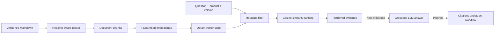

<div align="center">

# 📚 Version-Aware Documentation Assistant

### Ask technical questions. Retrieve evidence from the correct product version.

A version-aware retrieval-augmented generation project designed to prevent technical answers from mixing incompatible documentation versions.


</div>

---

## The Problem

Technical documentation changes between product releases. A conventional documentation chatbot may retrieve information from multiple versions and confidently provide outdated or conflicting guidance.

For example:

| Question | Version 1 | Version 2 |
|---|---:|---:|
| What is the API rate limit? | 100 requests/minute | 250 requests/minute |
| How do I authenticate? | API key | OAuth 2.0 |
| Which export formats are supported? | CSV | CSV and JSON |

This project prevents cross-version mixing by filtering the searchable knowledge base before semantic ranking and answer generation.

## Project Objective

Build a documentation assistant that:

- Parses versioned technical documentation
- Creates meaningful, heading-aware chunks
- Generates semantic embeddings
- Stores vectors and metadata in Qdrant
- Filters retrieval by product and version
- Generates grounded answers with source citations
- Abstains when the selected documentation lacks sufficient evidence
- Uses bounded agent behavior for clarification, retrieval, and version comparison
- Measures retrieval quality, version isolation, citation accuracy, and latency

## Architecture



## Current Retrieval Flow

```text
User question
      ↓
Generate question embedding
      ↓
Filter by product and version
      ↓
Compare against eligible chunk vectors
      ↓
Rank by cosine similarity
      ↓
Return text, metadata, and similarity scores
```

Metadata filtering and semantic search serve different purposes:

- **Metadata filtering** defines where the system is allowed to search.
- **Semantic similarity** determines which eligible chunks best match the question.

## Example Retrieval Behavior

**Question**

> What is the API request limit?

**Product:** `examplecloud`  
**Selected version:** `v1`

```text
Top result: Request limits
Evidence: Version 1 permits 100 API requests per minute.
Source: examplecloud/v1/api-guide.md
```

Using the same question with `v2` changes the eligible search scope:

```text
Top result: Request limits
Evidence: Version 2 permits 250 API requests per minute.
Source: examplecloud/v2/api-guide.md
```

The v1 search cannot return a v2 chunk, and the v2 search cannot return a v1 chunk.

## Current Status

### Completed

- [x] Initialize the Python and FastAPI project
- [x] Add a `/health` endpoint
- [x] Create synthetic v1 and v2 technical documentation
- [x] Parse Markdown using heading-aware boundaries
- [x] Create immutable `DocumentChunk` objects
- [x] Derive product, version, source, title, and section metadata
- [x] Generate deterministic chunk identifiers
- [x] Generate embeddings with FastEmbed
- [x] Store vectors and payload metadata in Qdrant
- [x] Retrieve chunks using cosine similarity
- [x] Enforce product and version filters during retrieval
- [x] Preserve source metadata for future citations
- [x] Test semantic retrieval and version isolation
- [x] Validate invalid retrieval inputs
- [x] Maintain 15 passing automated tests

### In Progress

- [ ] Select relevant evidence using retrieval scores
- [ ] Generate grounded LLM answers
- [ ] Return structured source citations
- [ ] Abstain when evidence is insufficient
- [ ] Add a FastAPI question-answering endpoint

### Planned

- [ ] Add bounded agent behavior
- [ ] Support version clarification and comparison
- [ ] Create a larger evaluation dataset
- [ ] Measure retrieval, citation, and abstention quality
- [ ] Add a simple user interface
- [ ] Connect to Qdrant Cloud
- [ ] Deploy the application
- [ ] Record a project demonstration

## Project Structure

```text
version-aware-doc-assistant/
├── app/
│   ├── __init__.py
│   ├── ingestion.py
│   ├── main.py
│   ├── models.py
│   └── vector_store.py
├── data/
│   └── examplecloud/
│       ├── v1/
│       │   └── api-guide.md
│       └── v2/
│           └── api-guide.md
├── tests/
│   ├── __init__.py
│   ├── test_health.py
│   ├── test_ingestion.py
│   └── test_retrieval.py
├── .gitignore
├── README.md
└── requirements.txt
```

## Technology

| Area | Technology | Purpose |
|---|---|---|
| Language | Python 3.12 | Application and retrieval logic |
| API | FastAPI | Validated backend endpoints |
| Document processing | Custom Markdown parser | Heading-aware chunk creation |
| Embeddings | FastEmbed | Lightweight local embedding generation |
| Vector database | Qdrant | Vector storage, filtering, and similarity search |
| Similarity measure | Cosine similarity | Semantic ranking |
| Testing | Pytest | Unit and retrieval-isolation tests |
| Generation | LLM API | Grounded answers and agent decisions |
| Deployment | Render and Qdrant Cloud | Planned hosted architecture |

## Run Locally

### 1. Create a virtual environment

```cmd
python -m venv .venv
```

### 2. Activate it in Command Prompt

```cmd
.venv\Scripts\activate.bat
```

### 3. Install dependencies

```cmd
pip install -r requirements.txt
```

The embedding model may be downloaded during the first retrieval test.

### 4. Run the tests

```cmd
pytest -v
```

### 5. Start the API

```cmd
uvicorn app.main:app --reload
```

Open:

- Health check: http://127.0.0.1:8000/health
- Interactive API documentation: http://127.0.0.1:8000/docs

## Key Design Decisions

### Heading-aware chunking

Sections are split at level-two Markdown headings instead of arbitrary character boundaries. This preserves topic meaning and keeps related sentences together.

### Metadata on every chunk

Each chunk stores its product, version, source, title, and section. Because chunks are retrieved independently, each one must remain independently filterable and traceable.

### Filtering before semantic ranking

Product and version restrictions are enforced inside the Qdrant query. Wrong-version content is excluded before it can reach answer generation.

### Deterministic chunk identifiers

Chunk IDs are derived from stable metadata. Reprocessing the same logical section produces the same identifier and helps prevent duplicate vector records.

### Local Qdrant during development

Automated tests use Qdrant’s in-memory mode. This keeps tests isolated, reproducible, and independent of cloud credentials. The deployed application will use Qdrant Cloud through the same client abstraction.

### Controlled RAG before agents

The deterministic retrieval and generation pipeline is implemented and evaluated before agent behavior is added. This provides a measurable baseline and keeps agent tools bounded.

## Testing Strategy

The current tests verify:

- All expected Markdown sections are processed
- Version-specific facts remain distinct
- Chunk IDs are unique
- Source metadata is preserved
- All chunks are indexed
- Semantically related questions retrieve the expected section
- v1 searches return only v1 chunks
- v2 searches return only v2 chunks
- Unknown products return no results
- Invalid search inputs are rejected

## Evaluation Goals

The completed system will measure:

- Version-isolation accuracy
- Retrieval recall at `k`
- Top-result accuracy
- Citation correctness
- Answer correctness
- Proper abstention rate
- Agent tool-selection accuracy
- Response latency
- Approximate model cost

## Why This Project Matters

This project goes beyond a basic “chat with documents” demonstration. Its central challenge is reliable, metadata-aware retrieval across conflicting documentation versions.

The same architecture can later support:

- Product editions
- Programming-language versions
- Customer or tenant isolation
- Department-level permissions
- Role-based access control
- Time-sensitive policies
- Confidentiality classifications

## Current Limitations

- The dataset is intentionally small and synthetic
- Only Markdown documents are supported
- Qdrant currently runs locally during development
- Answer generation and citations are not yet implemented
- Retrieval thresholds require evaluation
- Agent behavior and deployment are still planned

These limitations are being addressed incrementally so that each layer can be tested independently.