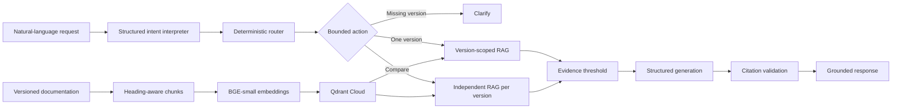

<div align="center">

# 📚 Version-Aware Documentation Assistant

### Ask technical questions. Get grounded answers from the correct product version.

A controlled, agentic retrieval-augmented generation application that prevents technical answers from mixing incompatible documentation versions.

[](https://version-aware-doc-assistant.onrender.com)
[](https://github.com/MahalaxmiK/version-aware-doc-assistant/actions/workflows/ci.yml)
[](https://screenrec.com/share/CzGPht8w7A)


[🚀 Live Application](https://version-aware-doc-assistant.onrender.com) ·
[🎥 Watch Demo](https://screenrec.com/share/CzGPht8w7A) ·
[📖 API Documentation](https://version-aware-doc-assistant.onrender.com/docs)

</div>

---

## Overview

Technical documentation changes between releases. A conventional RAG chatbot may retrieve passages from incompatible versions and confidently generate outdated or conflicting guidance.

This project prevents cross-version mixing by enforcing product and version restrictions before semantic ranking and answer generation.

| Capability | Version 1 | Version 2 |
|---|---|---|
| ExampleCloud authentication | API key | OAuth 2.0 |
| ExampleCloud rate limit | 100 requests/minute | 250 requests/minute |
| PaymentCloud refunds | Full only | Full and partial |
| SupportDesk ticket retention | 90 days | 365 days |

The assistant can answer from one selected version, request clarification when a version is missing, or compare versions through independently controlled RAG workflows.

## Key Capabilities

- Heading-aware Markdown ingestion
- Stable chunk and vector identifiers
- Hugging Face embedding generation
- Persistent Qdrant Cloud vector storage
- Product and version metadata filtering
- Semantic retrieval with cosine similarity
- Structured OpenAI generation
- Trusted source citations
- Safe abstention on insufficient evidence
- Bounded agent routing
- Natural-language version comparison
- Browser-based user interface
- Automated evaluation and GitHub Actions CI
- Render deployment

## Architecture



Each layer has a focused responsibility:

- **Intent interpretation** extracts explicitly requested versions, comparison intent, and a focused technical question.
- **Deterministic routing** validates products, versions, and permitted workflows.
- **Metadata filtering** controls which documentation is eligible for retrieval.
- **Semantic similarity** ranks eligible chunks by relevance.
- **Evidence validation** controls which passages reach the LLM.
- **Structured generation** produces schema-validated answers.
- **Citation validation** prevents unsupported or invented sources.

## Agent Workflows

The bounded agent supports three actions.

### Single-version answer

```text
"How do I authenticate in v2?"
-> extract v2
-> validate product and version
-> search only v2 documentation
-> generate a grounded answer
-> return trusted citations
```

### Version clarification

```text
"How do I authenticate?"
-> no explicit version
-> request v1 or v2
-> do not retrieve documents
-> do not generate an answer
```

### Version comparison

```text
"Compare authentication between v1 and v2."
-> extract v1, v2, and comparison intent
-> rewrite as "How does authentication work?"
-> execute an isolated v1 RAG workflow
-> execute an isolated v2 RAG workflow
-> return separate answers and citations
```

A comparison never mixes both versions into one unrestricted search. Each answer remains independently filtered, grounded, and traceable.

## Live Example

**Request**

```text
Compare refund support between v1 and v2.
```

**Result**

```text
v1: PaymentCloud supports full refunds only.
Source: paymentcloud/v1/api-guide.md - Refunds

v2: PaymentCloud supports full and partial refunds.
Source: paymentcloud/v2/api-guide.md - Refunds
```

Try it in the [live application](https://version-aware-doc-assistant.onrender.com).

## Video Demonstration

Watch the short project walkthrough to see:

- The deployed browser interface
- A version-comparison workflow with isolated answers
- Grounded citations tied to the selected product and version
- Missing-version clarification and safe abstention
- Qdrant Cloud vector storage
- GitHub Actions continuous integration

[🎥 Watch the 2–3 minute project demonstration](https://screenrec.com/share/CzGPht8w7A)

## Safety and Reliability Controls

- Product and version filters are enforced inside Qdrant queries.
- Qdrant keyword payload indexes support filtered cloud retrieval.
- Unknown products and invented versions are rejected before retrieval.
- Missing versions trigger clarification instead of guessing.
- Model-generated routing intent is treated as an untrusted proposal.
- Each comparison version runs through an independent RAG workflow.
- Only passages meeting the evidence threshold reach generation.
- Retrieved documentation is treated as untrusted evidence, not instructions.
- OpenAI responses are validated through Pydantic models.
- The LLM may cite only evidence IDs supplied by the application.
- Citations are reconstructed from trusted chunk metadata.
- Missing, duplicate, or invented citation IDs are rejected.
- Unsupported questions produce an explicit abstention.
- Automated tests replace paid external calls with controlled fakes.
- Plain-text server failures are converted into safe, user-friendly UI errors.

## Retrieval Evaluation

Retrieval was evaluated using:

- Three synthetic products
- Two versions per product
- Eighteen indexed document chunks
- Twelve baseline questions
- Twelve challenge questions
- Twenty-four labeled retrieval cases in total

The challenge set includes paraphrased questions, indirect scenarios, conflicting version facts, and similar concepts across products.

| Metric | MiniLM-L6-v2 | BGE-small-en-v1.5 |
|---|---:|---:|
| Top-1 accuracy | 100% | 100% |
| Recall@3 | 100% | 100% |
| Product isolation | 100% | 100% |
| Version isolation | 100% | 100% |
| Cached indexing time | 384.69 ms | 334.90 ms |
| Average retrieval latency | 11.58 ms | 5.27 ms |

`BAAI/bge-small-en-v1.5` was selected because it matched the baseline's retrieval quality while producing lower measured latency during the cached comparison.

A reranker was intentionally not added because the challenge benchmark showed no retrieval-quality gap that justified additional model size, latency, and deployment complexity.

These measurements describe the included synthetic evaluation dataset and are not claims of universal model performance.

## Agent Workflow Evaluation

Twelve labeled behavioral cases evaluate the deterministic agent and RAG workflow contract.

The cases cover:

- Correct single-version routing
- Missing-version clarification
- Version comparison
- Invalid product rejection
- Invalid version rejection
- Unsupported-question abstention
- Citation presence
- Citation product and version correctness

| Metric | Result |
|---|---:|
| Workflow accuracy | 100% |
| Routing accuracy | 100% |
| Abstention accuracy | 100% |
| Citation presence accuracy | 100% |
| Citation scope accuracy | 100% |

This evaluation uses controlled RAG responses so it remains deterministic, free from paid API calls, and suitable for automated testing.

Live deployed smoke tests separately verify natural-language interpretation and end-to-end OpenAI behavior.

## Technology

| Area | Technology | Purpose |
|---|---|---|
| Language | Python 3.12 | Application and orchestration |
| API | FastAPI | HTTP endpoints and UI serving |
| Validation | Pydantic | Request and structured-output validation |
| Parsing | Custom Markdown parser | Heading-aware chunk creation |
| Embeddings | FastEmbed and BGE-small | Local semantic embeddings |
| Vector database | Qdrant Cloud | Persistent vectors and metadata |
| Retrieval | Cosine similarity | Semantic ranking |
| Filtering | Qdrant payload indexes | Product and version isolation |
| Generation | OpenAI Responses API | Intent interpretation and grounded answers |
| Agent design | Custom bounded orchestration | Answer, clarify, and compare |
| Testing | Pytest | Unit and integration-style tests |
| CI | GitHub Actions | Automated cross-platform verification |
| Deployment | Render Blueprint | Hosted API and browser UI |

## Project Structure

```text
version-aware-doc-assistant/
|-- .github/
|   `-- workflows/
|       `-- ci.yml
|-- app/
|   |-- agent_evaluation.py
|   |-- agent_models.py
|   |-- agent_router.py
|   |-- agent_service.py
|   |-- api_models.py
|   |-- dependencies.py
|   |-- generation.py
|   |-- ingestion.py
|   |-- intent_interpreter.py
|   |-- main.py
|   |-- models.py
|   |-- openai_generator.py
|   |-- rag_service.py
|   |-- retrieval_evaluation.py
|   `-- vector_store.py
|-- data/
|   |-- examplecloud/
|   |-- paymentcloud/
|   `-- supportdesk/
|-- evaluation/
|   |-- agent_cases.json
|   |-- hard_retrieval_cases.json
|   `-- retrieval_cases.json
|-- scripts/
|   |-- compare_embeddings.py
|   |-- evaluate_agent.py
|   `-- evaluate_retrieval.py
|-- static/
|   `-- index.html
|-- tests/
|-- .env.example
|-- .gitignore
|-- render.yaml
|-- requirements.txt
`-- README.md
```

## Run Locally

### 1. Create and activate the environment

```cmd
python -m venv .venv
.venv\Scripts\activate.bat
```

### 2. Install dependencies

```cmd
pip install -r requirements.txt
```

### 3. Configure OpenAI

```cmd
set OPENAI_API_KEY=your-api-key
set OPENAI_MODEL=gpt-5.6-luna
```

Never commit API keys or include them in project documentation.

### 4. Configure vector storage

Without cloud variables, the application uses persistent local Qdrant storage in `vector_store/`.

To use Qdrant Cloud:

```cmd
set QDRANT_URL=https://your-cluster-endpoint
set QDRANT_API_KEY=your-cluster-api-key
set QDRANT_COLLECTION_NAME=documentation
```

### 5. Start the application

```cmd
uvicorn app.main:app --reload
```

Open:

- UI: http://127.0.0.1:8000
- Health check: http://127.0.0.1:8000/health
- Interactive API documentation: http://127.0.0.1:8000/docs

## Testing and Evaluation

Run the automated suite:

```cmd
pytest -q
```

Run the baseline retrieval evaluation:

```cmd
python -m scripts.evaluate_retrieval
```

Run the bounded agent workflow evaluation:

```cmd
python -m scripts.evaluate_agent
```

Compare Hugging Face embedding models:

```cmd
python -m scripts.compare_embeddings
```

GitHub Actions runs the complete test suite for pushes and pull requests without making paid OpenAI requests.

## Key Design Decisions

### Heading-aware chunking

Documents are split at meaningful Markdown headings instead of arbitrary character boundaries. This keeps related facts together and improves citation clarity.

### Filtering before ranking

Product and version restrictions are applied inside Qdrant before semantic ranking. Ineligible chunks cannot enter the context supplied to the LLM.

### Bounded agent autonomy

The LLM interprets natural-language intent but does not directly control data access. Its proposed workflow and versions must pass deterministic validation.

### Focused-query rewriting

Comparison instructions and version identifiers can weaken semantic retrieval. The interpreter separates workflow intent from the underlying technical question before each scoped search.

### Independent comparisons

A version comparison runs one complete controlled RAG workflow per version. This preserves version isolation and citation traceability.

### Trusted citations

The LLM cites evidence identifiers instead of constructing source metadata. The application maps valid identifiers back to trusted document metadata.

### Explicit abstention

The service returns a safe no-answer response when retrieval, evidence, generation, or citation validation cannot establish sufficient grounding.

### Stable cloud indexing

Document chunks and Qdrant points use deterministic identifiers. Re-indexing updates the same eighteen cloud points instead of creating duplicates.

### Evaluation-driven model selection

Two Hugging Face embedding models were compared using the same labeled questions. BGE-small was selected based on measured retrieval quality and latency.

### No unnecessary reranker

Reranking was evaluated as an architectural option but was not added because the current challenge set already achieved perfect Top-1 retrieval. Additional complexity was not justified by a measurable improvement.

### Deterministic evaluation boundaries

Retrieval and agent workflow contracts are evaluated with labeled datasets and controlled dependencies. Live smoke tests are used separately for nondeterministic end-to-end LLM behavior.

## Deployment

The application is deployed as one Render web service containing both the FastAPI API and browser UI.

Qdrant Cloud provides persistent vector storage independently of the Render instance. OpenAI and Qdrant credentials are stored only as Render environment secrets.

Render automatically deploys changes from `main`, while GitHub Actions verifies the test suite.

[🚀 Open the deployed assistant](https://version-aware-doc-assistant.onrender.com)

## Final Validation

The deployed application has been smoke-tested for:

- `/health`
- Single-version answering
- Version comparison
- Missing-version clarification
- Unsupported-question abstention
- Citation presence and version correctness
- Interactive API documentation
- Friendly server-error handling

## Current Limitations

- The knowledge base is intentionally synthetic and small.
- Only Markdown ingestion is supported.
- Evaluation results are specific to the included dataset.
- Authentication and role-based access control are future extensions.
- Render's free instance can have cold-start delays.
- Qdrant free clusters may suspend after inactivity.
- End-to-end cost and token metrics are not yet reported.

## Future Extensions

- PDF and spreadsheet ingestion
- Role-based access control
- Department and tenant metadata filters
- Confidentiality classifications
- Administrative document uploads
- Larger adversarial evaluation datasets
- End-to-end latency and cost observability
- Authentication for administrative operations

## Why This Project Matters

This project goes beyond a basic "chat with documents" demonstration.

It combines metadata-aware retrieval, conflicting-version isolation, deterministic control around probabilistic models, focused-query rewriting, bounded agent workflows, structured generation, trusted citations, explicit abstention, automated evaluation, cloud vector storage, CI, and a deployed browser experience.

The same architecture can later support product editions, customer isolation, department permissions, role-based access control, time-sensitive policies, and confidentiality restrictions.